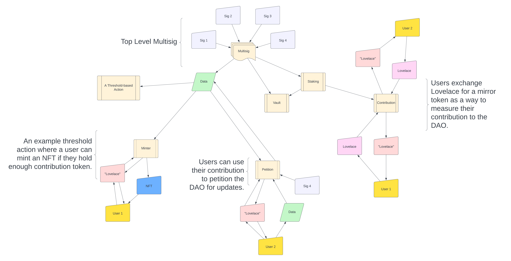

# A Model Mint-Lock-Stake DAO With Threshold-based Actions

A proof of concept that models a semi-liquid `mint-lock-stake` DAO designed to collect Lovelace from users wishing to use the DAO's threshold-based actions. The semi-liquid nature allows the purchasing power of lovelace to be maintained by the user as the mirror token represents a one-to-one lovelace connection but the staking power is given to the DAO.



# Building

The DAO data contract assumes the starter token information will be provided at compile time. The uniqueness of this starter token must be guarenteed but it may come from a smart contract or native script minting policy. The policy id and token name information is contained in the `start_info.json` file. This file also contains the pool id for the stake contract as well as a random hex string for contract initialization.

```json
{
  "__comment1__": "This is the starter token for the data reference contract.",
  "starterPid": "d71d15d49f1cb409d0f3863188909af20da621b8e2baa7caae722d0e",
  "starterTkn": "9877cd0707f500970050fb0216090b080862ad16c421a3212d6f6350602beda6",
  "__comment2__": "The stake will delegate to this pool id.",
  "poolId": "8ffb4c8e648c0662f2a91157c92feaa95f1a3d2728eaea8257b3d8d9",
  "__comment3__": "A random string to use for contract generation.",
  "random": "acab"
}
```

Be sure to update rust and aiken, remove the old build folder, then run the complete build script. This makes sure the contracts are using the most up-to-date versions at compile time.

```bash
rustup update
aikup
rm -fr build/ || true
./complete_build.sh
```

# Set Up

The `scripts` folder provides a happy path to follow as well as all the wallet and datum / redeemer information. The test scripts will allow the DAO to update the multisig and data, the stake to be delegated and rewarded, and the ability to mint and burn mirror tokens. The mirror tokens can be used to initate threshold-based actions. 

There can only be one DAO data UTxO by design but there can be many stake and lock UTxOs, allowing for sharding for greater efficiency.

## Wallets

The happy path assumes there are specific wallets that exist and are funded with enough lovelace to pay for the transaction fees. The `create_wallet.sh` script will auto create the required wallet files given a specific wallet path.

```bash
./create_wallet.sh wallets/collat-wallet
./create_wallet.sh wallets/delegator-wallet
./create_wallet.sh wallets/keeper1-wallet
./create_wallet.sh wallets/keeper2-wallet
./create_wallet.sh wallets/keeper3-wallet
./create_wallet.sh wallets/reference-wallet
./create_wallet.sh wallets/reward-wallet
./create_wallet.sh wallets/starter-wallet
```

The balances can be viewed with `./all_balances.sh`.

## Reference Scripts

After the wallets are funded, the reference wallet will need to pay to create the script references for the happy path.

```bash
./00_createScriptReferences.sh
```

This will auto chain all the script references together.

## Helper Scripts

The balances of the smart contracts and wallets can be viewed with `./all_balances.sh`. The `get_pkh.sh` script can be used to find the pkh of an addressed passed as a variable. The `trade_token.sh` script can be used to send tokens around if the wallets need to be cleaned up.

# Using The DAO

This proof-of-concept using a two-teir system where the upper tier is controlled by the multisig DAO and the lower teir is controlled by contributors delegating their Lovelace to the DAO.

## Data Contract

Inside the `dao` folder are all the scripts for updating the mutlisig and data. The scripts update the data from the `data/dao/update-dao-datum.json` file so any changes will need to made to that file for DAO data updates. This is also the file that the `complete_build.sh` file updates at compile time.

Use the `starter` wallet and create the DAO UTxO.

```bash
./01_createDAOUTxO.sh
```

The multisig is updated with `02_updateManagement.sh` and the data is updated with `03_updateData.json`. A user with enough mirror tokens may use `04_petitionDAO.sh` to update the data.

## Stake Contract

Inside the `stake` folder are all the scripts for registering, delegating, and withdrawing from the stake contract. The stake contract can only be delegated to the pool id and be rewarded to the vault contract. The stake contract takes in a random hex string so many different stake contracts can be compiled if required.

Use the `starter` wallet and register the stake contract.

```bash
./01_registerStake.sh
```

The stake can be delegated with `02_delegateStake.sh` and rewards can be withdrawn with `03_withdrawStakeRewards.json` both of which use the DAO multisig.

## Vault Contract

Inside the `vault` folder are all the scripts for creating, adding, and subtracting from the vault contract. The vault is design to accumulate rewards from staking and any profit for the DAO. The vault is designed to have many vault UTxOs as their only purpose is to accumulate Lovelace.

Use the `starter` wallet and register the stake contract.

```bash
./01_createVaultUTxO.sh
```

Anyone can add Funds to the vault with `02_addToVault.sh` but subtracting from the vault with `03_subFromVault.json` requries using the DAO multsig.

## Minting Mirror Tokens

Inside the `mint` folder are all the scripts for creating the lock UTxO and minting and burning mirror tokens. There can be any number of lock UTxOs but only one is needed for the happy path.

Use the `starter` wallet and start the lock contract.

```bash
./01_createLockUTxO.sh
```

The `delegator` wallet can be used to mint and burn mirror tokens. The tokens are one-to-one with lovelace.

For example, the delegator can mint 123456789 "lovelace" into their wallet and will lock 123456789 lovelace into the lock contract.

```bash
./02_mintTokens.sh 123456789
```

The delegator may also burn their tokens and get their lovelace back.

```bash
./03_burnTokens.sh 123456789
```

This will burn 123456789 "lovelace" from their wallet and will unlock 123456789 lovelace from the lock contract.

Now with many lock contracts, many delegators may place their ada into the lock contract in exchange for the token. The DAO will now control the staking power of the locked lovelace but the delegators control their buying power with their "lovelace" token. At any time, delegators may return to retrieve their lovelace from the contract and regain control of their staking power.

# Using Threshold-Based Actions

Now that users have the "lovelace", they may act on the behalf of the DAO with the available threshold-based actions. Each action requires a certain amount of the "lovelace" to be inside the transaction, proving that the user(s) has/have enough contribution to the DAO to be able to act. This system allows for many different actions to be built and added to the ecosystem without any required hardforks to the original data or mint/lock contract as these contracts depend solely on policy id of "lovelace". But each new action will require an update to the DAO data as each action has its own threshold requirement.

## NFT Minting

An NFT is allowed to be minted or burned if and only if the transaction contains inputs that hold a minimum amount of "lovelace". The user(s) that create this transaction may do as they please with the NFT. Each NFT is prefixed with "~DAO".

This will mint an NFT into the delegator wallet if and only if the delegator has enough "lovelace".

```bash
./01_mintNFT.sh
```

This will burn an NFT from the delegator wallet if and only if the delegator has enough "lovelace".

```bash
./02_burnNFT.sh
```

This NFT generator is great for starter and pointing tokens but the prefix is fixed so it may not serve well with cip 68 / 721 compliant tokens.

## Petition DAO

A user with enough mirror tokens may petition the DAO to update the data. This threshold action is paired with a witness signature. Some amount of members from the multisig group must sign the transaction to verify that the user has logical data. The threshold for the number of witnesses can be set to zero which would allow large contributors to control the DAO Data but not the ability to spend from the vault.

The delegator may petition the DAO for a data change if and only if they have enough "lovelace".

```bash
./04_petitionDAO.sh
```

The data update is verified by a member of the multsig and is submitted.
